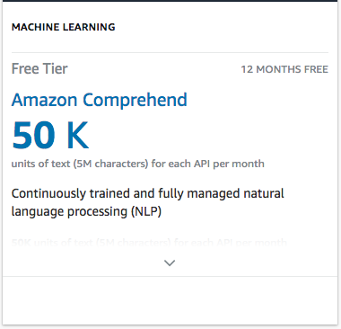
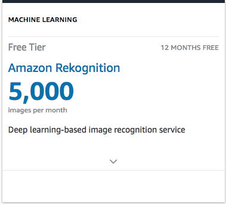
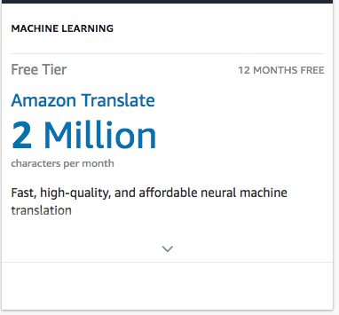
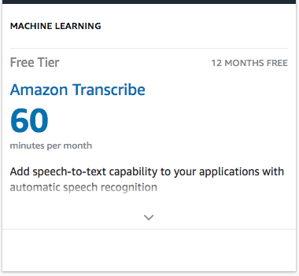
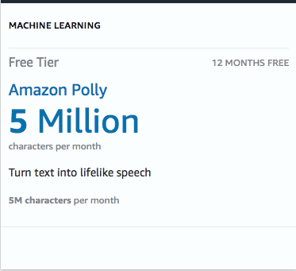

# ByteConf
ByteConf presentation to be streamed on Twitch March 22-23

### Slides are under Reveal.js. to start slides, run npm start from inside the folder.

### React demo under ml-javscript folder. To start run npm start from inside that folder.

### `npm start`

Runs the app in the development mode. 
Open [http://localhost:3000](http://localhost:3000) to view it in the browser.

The page will reload if you make edits. 
You will also see any lint errors in the console.

# Free Tier Usage for ML API's in our project

